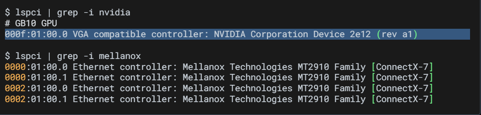
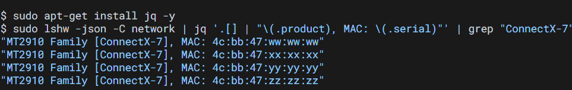
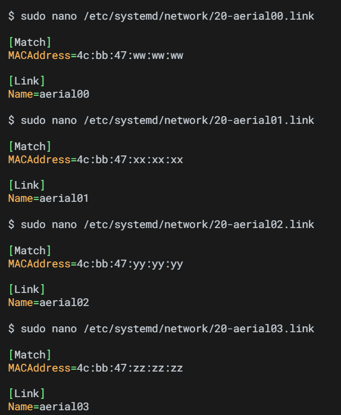
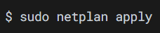

## 1. Cable Connection  
### (1).Host OS Internet Connection  
1.CX7 QSFP ports for fronthaul and backhaul connections  
2.RJ45 port for the host OS internet connection.  

### (2). E2E(End to End) Test Connection  
1.CX7 fronthaul port#0 or port#1 must be connected to the fronthaul switch.  
2.Make sue the PTP is configured to use the port connected to the fronthaul switch.  

## 2. Disable Secure Boot  
1.Reboot and press Esc to enter the UEFI BIOS menu.  
2.Use right arrow key to navigate to Security tab.  
3.use down arrow key to navigate to Secure Boot menu and press Enter.  

4.down arrow to select Disable and press Enter.  

5.Press F4 to save and exit.  

## 3. DGX Spark First-Time Setup  

### 1.GPU  
code :  
$ lspci | grep -i nvidia  
(1) lspci : 列出所有 PCI / PCIe 裝置，例如:顯示卡 GPU、網卡 NIC、SSD Controller、USB Controller 和 RAID 卡等。  
(2) | : 把前面指令輸出，交給後面處理。  
(3) grep -i nvidia : 搜尋包含 nvidia 的文字， grep : 搜尋文字。 -i : 忽略大小寫。

Output:  
000f:01:00.0 VGA compatible controller : NVIDIA Corporation Device 2e12 (rev a1)  
(1) 000f:01:00.0 : PCIe 裝置位址 ， 格式 : Domain:Bus:Device.Function  
(2) VGA compatible controller : 顯示控制器（GPU)  
(3) NVIDIA Corporation : 製造商 ： NVIDIA  
(4) Device 2e12 : 裝置 ID

## 2.NIC  
code :    
lspci | grep -i mellanox  
(1) mellanox : Mellanox 裝置， 如:ConnectX NIC、InfiniBand、SmartNIC 和 RDMA  

Output:  
4 Output  
2 ConnectX-7, each one with two ports  
2 NIC × 2 port = 4 Ethernet function  

## 4. Configure the Network Interfaces (For the following steps)  
Purpose : Ensure that you have the proper netplan config for your local network.  
The network interface names could change after reboot  
--> Create a persistent net link files under /etc/systemd/network, one for each interface.  
Target : To ensure persistent network interface names after reboot  

### (1). Run to check for network devices and look for the entries.  
--> To find the MAC address of the CX7 NIC.  

code :  
$ sudo apt-get install jq -y  
功能: 安裝 jq 工具  
(1) sudo : 以管理員權限執行  
(2) apt-get install : 安裝軟體  
(3) jq : 一個專門處理 JSON 格式資料的工具，Linux 查硬體時常輸出 JSON，所以 jq 很重要。  
(4) -y : 自動回答 yes  

code :  
$ sudo lshw -json -C network  
功能: 取得所有網卡的詳細資料（用 JSON 格式）  
| jq '.[] | "\(.product), MAC: \(.serial)"'  
功能: 把 JSON 轉成人類看得懂的文字   
| grep "ConnectX-7"  
功能: 只留下 ConnectX-7

(1) lshw : list hardware ， 列出電腦硬體資訊。    
(2) -json : 輸出 JSON 格式，方便 jq 處理。  
(3) -C network : 只列出 network 類別，Ethernet card, NIC, Mellanox 和 Wi-F.  
(4) .[] : 把 JSON 裡「每一個網卡」拿出來  
(5) \(.product) : 取出「網卡型號」  
    \(.serial) : 取出「MAC 位址」 

Output:  
所有 ConnectX-7 網卡 + 每個 port 的 MAC

### (2). Create files at /etc/systemd/network/ with the desired name for the interface and the MAC address found in the previous step.  
功能: 把每張 Mellanox 網卡（用 MAC 位址辨識）固定重新命名成 aerial100~103  

code:  
(1):  
sudo nano /etc/systemd/network/20-aerial100.link  
作用: 用 nano 編輯一個 link 規則檔  
(2):   
[Match]  
MACAddress=4c:bb:47:ww:ww:ww  
作用: 找到 MAC 是這個的網卡  
(3):  
[Link]  
Name=aerial100  
作用: 把這張卡改名叫 aerial100  

NOTE:  
後面的文件都會假設：
(1):aerial00、aerial01 是拿來接 RU / fronthaul  
(2):而且 aerial00 專門拿來做 PTP（時間同步）  

### (3). Apply the change

code:  
$ sudo netplan apply  
功能: 套用（啟用）你目前設定的網路配置。  
(1): netplan : Ubuntu 的網路管理工具，用來設定 IP 位址 、 DHCP / static IP 、 gateway 、 DNS 、 網卡設定。  
(2): apply : 套用設定，把設定檔 → 變成實際網路狀態。  
