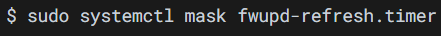
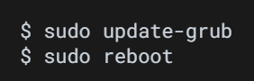

## Table of Contents:  
### 1.Cable Connection  
(1):Host OS Internet Connection  
(2):E2E Test Connection  
### 2.Disable Secure Boot  
### 3.DGX Spark First-Time Setup  
### 4.Configure the Network Interfaces  
### 5.Disable Auto Upgrade  
### 6.Install NVIDIA Optimized Ubuntu Kernel  
### 7.Configure Linux Kernel Command-line  
### 8.Apply the Changes and Reboot to Load the Kernel  
### 9.Install Dependency Packages  
### 10.Install DOCA OFED and Mellanox Firmware Tools on the Host  
### 11.Install CUDA Driver  
### 12.Install Docker and Nvidia Container Toolkit  
### 13.Install ptp4l and phc2sys  
### 14.Setup the Boot Configuration Service  
### 15.Validating software-component versions and system configurations  

---
## 1. Cable Connection  
### (1). Host OS Internet Connection  
1. CX7 QSFP ports for fronthaul and backhaul connections.  
2. RJ45 port for the host OS internet connection.  

### (2). E2E(End to End) Test Connection  
1. CX7 fronthaul port#0 or port#1 must be connected to the fronthaul switch.  
2. Make sue the PTP is configured to use the port connected to the fronthaul switch.  

---
## 2. Disable Secure Boot  
1. Reboot and press Esc to enter the UEFI BIOS menu.  
2. Use right arrow key to navigate to Security tab.  
3. Use down arrow key to navigate to Secure Boot menu and press Enter.  

4. Down arrow to select Disable and press Enter.  

5. Press F4 to save and exit.  

---
## 3. DGX Spark First-Time Setup  

### 1. GPU  
code :  
$ lspci | grep -i nvidia  
Function: Check whether the system has an NVIDIA device installed (typically an NVIDIA GPU).  

(1). lspci : List all PCI / PCIe devices, such as graphics cards (GPU), network cards (NIC), SSD controllers, USB controllers, and RAID cards.  
(2). | : Pass the output of the previous command to the next command for processing.  
(3). grep -i nvidia : Search for text containing "nvidia".  
grep : Search text.  
-i : Ignore uppercase and lowercase differences.  

Output:  
000f:01:00.0 VGA compatible controller : NVIDIA Corporation Device 2e12 (rev a1)  

(1) 000f:01:00.0 : PCIe device address, format : Domain:Bus:Device.Function  
(2) VGA compatible controller : Display controller (GPU)  
(3) NVIDIA Corporation : Manufacturer : NVIDIA  
(4) Device 2e12 : Device ID  

## 2. NIC  

code :  
$ lspci | grep -i mellanox  
Function: List all PCIe devices, then display only Mellanox-related hardware.  

(1) mellanox : Mellanox devices, such as ConnectX NICs, InfiniBand, SmartNICs, and RDMA devices.  

Output:  
4 Output  
2 ConnectX-7 cards, each with two ports  
2 NICs × 2 ports = 4 Ethernet functions  

---
## 4. Configure the Network Interfaces (For the following steps)  

Purpose : Ensure that you have the proper netplan config for your local network.  
The network interface names could change after reboot  
--> Create a persistent net link files under /etc/systemd/network, one for each interface.  
Target : To ensure persistent network interface names after reboot  

### (1). Run to check for network devices and look for the entries.  
--> To find the MAC address of the CX7 NIC.  

code :  
$ sudo apt-get install jq -y  
Function: Install the jq utility  

(1) sudo : Execute with administrator privileges  
(2) apt-get install : Install software  
(3) jq : A tool specifically designed for processing JSON-formatted data. Hardware information in Linux is often output in JSON format, so jq is very important.  
(4) -y : Automatically answer "yes"  

code :  
$ sudo lshw -json -C network  
Function: Retrieve detailed information about all network cards (in JSON format)  
| jq '.[] | "(.product), MAC: (.serial)"'  
Function: Convert JSON data into human-readable text  
| grep "ConnectX-7"  
Function: Keep only ConnectX-7 entries  

(1) lshw : list hardware, display computer hardware information.  
(2) -json : Output in JSON format for easier processing with jq.  
(3) -C network : Show only devices in the network category, such as Ethernet cards, NICs, Mellanox devices, and Wi-Fi adapters.  
(4) .[] : Extract each network card entry from the JSON data.  
(5) (.product) : Retrieve the network card model.  
  (.serial) : Retrieve the MAC address.  

Output:  
All ConnectX-7 network cards + the MAC address of each port.  

### (2). Create files at /etc/systemd/network/ with the desired name for the interface and the MAC address found in the previous step.  

Function: Permanently rename each Mellanox network card (identified by its MAC address) to aerial100~103.  

code:  
(1):  
$ sudo nano /etc/systemd/network/20-aerial100.link  
Purpose: Use nano to edit a link rule file.  

(2):  
[Match]  
MACAddress=4c:bb:47:ww:ww:ww  
Purpose: Match the network card with this MAC address.  

(3):  
[Link]  
Name=aerial100  
Purpose: Rename this network card to aerial100.  

NOTE:  
The following documents will assume that:  
(1): aerial00 and aerial01 are used for connecting to the RU / fronthaul.  
(2): aerial00 is specifically used for PTP (time synchronization).  

### (3). Apply the change  

code:  
$ sudo netplan apply  
Function: Apply (activate) the current network configuration settings.  

(1): netplan : Ubuntu’s network management tool, used to configure IP addresses, DHCP / static IP, gateways, DNS, and network interface settings.  
(2): apply : Apply the configuration, turning the configuration files into the actual network state.  

---
## 5. Disable Auto Upgrade  

1. Purpose : prevents the installed version of the low latency kernel from being accidentally changed with a subsequent software upgrade.  
--> Edit the system file, and change the “1” to “0” for both lines.  

code:  
$ sudo nano /etc/apt/apt.conf.d/20auto-upgrades  
Function: Open Ubuntu’s automatic update configuration file to modify its settings.  

APT::Periodic::Update-Package-Lists "0";  
Purpose: Disable automatic updates of the package lists.  
"1" means enabled, "0" means disabled.  

APT::Periodic::Unattended-Upgrade "0";  
Purpose: Disable automatic installation of updates.  
"1" means semi-automatic updates enabled, "0" means completely disabled.  

(1): nano : Open the text editor.  
(2): APT : Ubuntu’s package management system.  
(3): Periodic : Periodic / automatically scheduled.  
(4): Update-Package-Lists : Update the package lists.  
(5): Unattended-Upgrade : Unattended upgrades (automatic updates without user interaction).  
(6): /etc/apt/apt.conf.d/20auto-upgrades : Ubuntu automatic update configuration file.  

2. Disable the fwupd-refresh timer   
--> Prevent fwupdmgr from automatically checking for any updates.   

code:  
$ sudo systemctl mask fwupd-refresh.timer  
Function: Disable automatic firmware updates.  

(1): systemctl : Control systemd services.  
(2): mask : Completely block a service (strongest way to disable it).  
(3): fwupd-refresh.timer : Periodically check for firmware updates.  

---
## 6. Install NVIDIA Optimized Ubuntu Kernel

### 1. Install the NVIDIA optimized Ubuntu kernel

$ sudo apt update    
$ sudo apt install -y linux-image-6.17.0-1014-nvidia  
#NOTE: This will install the specific kernel version, not the latest NVIDIA optimized kernel.

code:  
$ sudo apt update  
Function: Check which software packages are currently available for installation.  
$ sudo apt install -y linux-image-6.17.0-1014-nvidia  
Function: Install the specified NVIDIA version of the Linux kernel.  

(1): update : Refresh the package list so the system knows which versions are available in the repositories.  
(2): linux-image-6.17.0-1014-nvidia :
The name of the Linux kernel package to be installed.  

### 2. Update grub to change the default boot kernel  

#The version to use here depends on the latest version that was installed with the previous command.  

$ sudo sed -i 's/^GRUB_DEFAULT=.*/GRUB_DEFAULT="Advanced options for DGX OS GNU\/Linux>DGX OS GNU\/Linux, with Linux 6.17.0-1014-nvidia"/' /etc/default/grub  

code:
$ sudo sed -i 's/^GRUB_DEFAULT=.*/GRUB_DEFAULT="Advanced options for DGX OS GNU/Linux>DGX OS GNU/Linux, with Linux 6.17.0-1014-nvidia"/' /etc/default/grub  
Function: Change the default Linux boot kernel to NVIDIA’s specified version, 6.17.0-1014-nvidia, ensuring the system always boots into Linux 6.17.0-1014-nvidia by default.  

(1): sed : Linux text replacement tool.  
(2): -i : Modify the file directly (in-place).  
(3): 's/old_text/new_text/' : Search-and-replace syntax.  
(4): ^GRUB_DEFAULT=.* : Match all lines starting with GRUB_DEFAULT=.  
" ^ " indicates the beginning of the line.  
" GRUB_DEFAULT= " specifies the setting name.  
" .* " represents any following content.  
(5): GRUB_DEFAULT="Advanced options for DGX OS GNU/Linux>DGX OS GNU/Linux, with Linux 6.17.0-1014-nvidia"   
: Set Linux 6.17.0-1014-nvidia as the default boot option.  
In sed, " / " is a special character, so " \/ " is used to represent an actual " / ".  
(6): /etc/default/grub : GRUB configuration file, GRUB is Linux bootloader.  

Overall process :  

Modify the GRUB configuration  
↓  
Set the default kernel  
↓  
System boots into the NVIDIA kernel by default on the next startup  

---
## 7. Configure Linux Kernel Command-line  
Purpose: Ensure the iommu.passthrough=y kernel parameter is NOT passed to the kernel  
--> Edit the parameter in the grub file and append or update the parameters described below  

$ cat <<"EOF" | sudo tee /etc/default/grub.d/cmdline.cfg  
GRUB_CMDLINE_LINUX="$GRUB_CMDLINE_LINUX pci=realloc=off default_hugepagesz=1G hugepagesz=1G hugepages=24 tsc=reliable processor.max_cstate=0 audit=0 idle=poll rcu_nocb_poll nosoftlockup irqaffinity=0-3 kthread_cpus=0-3 isolcpus=managed_irq,domain,4-19 nohz_full=4-19 rcu_nocbs=4-19 earlycon module_blacklist=nouveau acpi_power_meter.force_cap_on=y init_on_alloc=0 preempt=none"  
EOF  

#NOTE: The hugepage size 1G is optimized for DGX Spark  

code:  
$ cat <<"EOF" | sudo tee /etc/default/grub.d/cmdline.cfg  
Function: Write the following kernel parameters into cmdline.cfg.  

(1): cat : Display text.  
(2): <<"EOF" : Treat all following text as input until EOF is encountered.  
(3): sudo tee : Write to a file with root privileges.  
(4): /etc/default/grub.d/cmdline.cfg : Create a new GRUB kernel parameter configuration file.  

code:  
GRUB_CMDLINE_LINUX="$GRUB_CMDLINE_LINUX pci=realloc=off default_hugepagesz=1G hugepagesz=1G hugepages=24 tsc=reliable processor.max_cstate=0 audit=0 idle=poll rcu_nocb_poll nosoftlockup irqaffinity=0-3 kthread_cpus=0-3 isolcpus=managed_irq,domain,4-19 nohz_full=4-19 rcu_nocbs=4-19 earlycon module_blacklist=nouveau acpi_power_meter.force_cap_on=y init_on_alloc=0 preempt=none"  
Function: Configure Linux for low-latency + realtime + DPDK + GPU-optimized mode  

(1): GRUB_CMDLINE_LINUX= : Set the Linux kernel boot parameters to this configuration.  
(2): pci=realloc=off : Disable PCIe resource reallocation to avoid PCIe resource conflicts.  
(3):  
default_hugepagesz=1G  
hugepagesz=1G  
: Linux memory normally uses 4KB pages, but DPDK/GPU workloads do not work well with highly fragmented small pages. Therefore, 1GB pages are used to reduce TLB misses, memory overhead, and latency. Without HugePages, DPDK may not run properly.  
(4): hugepages=24 : Allocate 24 × 1GB HugePages.  
(5): tsc=reliable : Force the use of a reliable time counter. 5G/PTP relies heavily on precise timing.  
(6): processor.max_cstate=0 : Prevent the CPU from entering power-saving sleep states, because CPU sleep states increase latency.  
(7): audit=0 : Disable Linux audit to reduce kernel overhead.  
(8): idle=poll : Keep the CPU awake and continuously polling. This consumes more power but provides the lowest latency.  
(9): rcu_nocb_poll : Make Linux RCU background work operate in polling mode, reducing interrupts and latency jitter, and improving DPDK / Aerial / 5G realtime stability.  
(10): nosoftlockup : Disable soft lockup checks to avoid false warnings under high load.  
(11): irqaffinity=0-3 : Pin IRQ interrupts to CPU 0-3 , leaving the other CPU cores for DPDK, cuBB, and GPU workloads.  
(12): kthread_cpus=0-3 : Allow kernel threads to run only on CPU0-3.  
(13): isolcpus=managed_irq,domain,4-19 : Isolate CPU 4-19 so Linux avoids using them. These cores are reserved for DPDK, cuBB, and realtime threads.  
(14): nohz_full=4-19 : Disable scheduler ticks on CPU 4-19 to reduce jitter.  
(15): rcu_nocbs=4-19 : Prevent RCU callbacks from running on CPU 4-19 to avoid interfering with realtime workloads.  
(16): earlycon : Enable Linux kernel debug messages during the very early boot stage, which helps debug kernel, driver, GPU, DPDK, or hardware initialization issues.  
(17): module_blacklist=nouveau : Disable the nouveau driver. Aerial must use the official NVIDIA driver.  
(18): acpi_power_meter.force_cap_on=y : Force-enable ACPI power meter power capping / monitoring features, making power and power-consumption management more stable on DGX/Aerial servers.  
(19): init_on_alloc=0 : Disable automatic memory zeroing during Linux memory allocation to reduce latency and CPU overhead, improving DPDK / Aerial / GPU server performance.  
(20): preempt=none : Disable kernel preemption to reduce context switching.  

code:  
EOF  
Function: End of the here document.  
---
## 8. Apply the Changes and Reboot to Load the Kernel

### 1. 重新生成開機設定以套用新 kernel 參數

code:
$ sudo update-grub
Function: 重新產生 GRUB 開機設定
$ sudo reboot
Function: 重新開機

### 2. Verify that the kernel command-line parameters are configured properly

$ uname -r
6.17.0-1014-nvidia

$ cat /proc/cmdline
BOOT_IMAGE=/boot/vmlinuz-6.17.0-1014-nvidia root=UUID=7283b2b3-af33-4bd9-a896-b70a086ab2d3 ro pci=realloc=off default_hugepagesz=1G hugepagesz=1G hugepages=24 tsc=reliable processor.max_cstate=0 audit=0 idle=poll rcu_nocb_poll nosoftlockup irqaffinity=0-3 kthread_cpus=0-3 isolcpus=managed_irq,domain,4-19 nohz_full=4-19 rcu_nocbs=4-19 earlycon module_blacklist=nouveau acpi_power_meter.force_cap_on=y init_on_alloc=0 preempt=none init_on_alloc=0 iommu.passthrough=0 console=tty0 plymouth.ignore-serial-consoles plymouth.use-simpledrm earlycon=uart,mmio32,0x16A00000 console=tty0 console=ttyS0,921600 crashkernel=1G-:0M quiet splash initcall_blacklist=tegra234_cbb_init pci=pcie_bus_safe vt.handoff=7

### 3. Check if hugepages are enabled

