## Table of Contents:  
### 1.Cable Connection  
(1):Host OS Internet Connection  
(2):E2E Test Connection  
### 2.Disable Secure Boot  
### 3.DGX Spark First-Time Setup  
### 4.Configure the Network Interfaces  
### 5.Disable Auto Upgrade  
### 6.Install NVIDIA Optimized Ubuntu Kernel  
### 7.Configure Linux Kernel Command-line  
### 8.Apply the Changes and Reboot to Load the Kernel  
### 9.Install Dependency Packages  
### 10.Install DOCA OFED and Mellanox Firmware Tools on the Host  
### 11.Install CUDA Driver  
### 12.Install Docker and Nvidia Container Toolkit  
### 13.Install ptp4l and phc2sys  
### 14.Setup the Boot Configuration Service  
### 15.Validating software-component versions and system configurations  

---
## 1. Cable Connection  
### (1). Host OS Internet Connection  
1. CX7 QSFP ports for fronthaul and backhaul connections.  
2. RJ45 port for the host OS internet connection.  

### (2). E2E(End to End) Test Connection  
1. CX7 fronthaul port#0 or port#1 must be connected to the fronthaul switch.  
2. Make sue the PTP is configured to use the port connected to the fronthaul switch.  

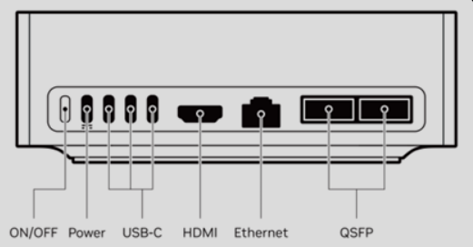

---
## 2. Disable Secure Boot  
1. Reboot and press Esc to enter the UEFI BIOS menu.  
2. Use right arrow key to navigate to Security tab.  
3. Use down arrow key to navigate to Secure Boot menu and press Enter.  

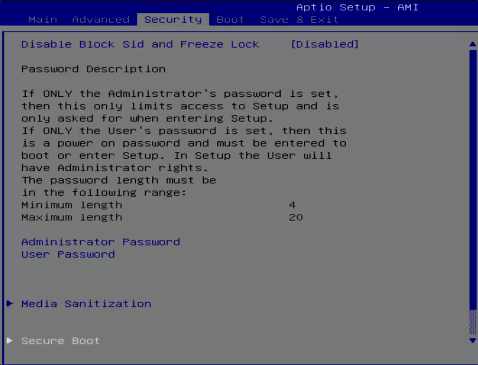

4. Down arrow to select Disable and press Enter.  

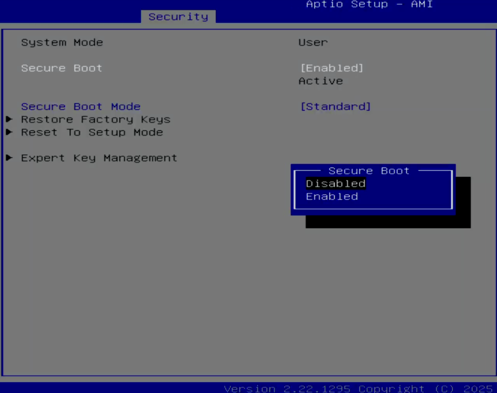

5. Press F4 to save and exit.  

---
## 3. DGX Spark First-Time Setup  

### 1. GPU  
code :  
$ lspci | grep -i nvidia  
Function: Check whether the system has an NVIDIA device installed (typically an NVIDIA GPU).  

(1). lspci : List all PCI / PCIe devices, such as graphics cards (GPU), network cards (NIC), SSD controllers, USB controllers, and RAID cards.  
(2). | : Pass the output of the previous command to the next command for processing.  
(3). grep -i nvidia : Search for text containing "nvidia".  
grep : Search text.  
-i : Ignore uppercase and lowercase differences.  

Output:  
000f:01:00.0 VGA compatible controller : NVIDIA Corporation Device 2e12 (rev a1)  

(1) 000f:01:00.0 : PCIe device address, format : Domain:Bus:Device.Function  
(2) VGA compatible controller : Display controller (GPU)  
(3) NVIDIA Corporation : Manufacturer : NVIDIA  
(4) Device 2e12 : Device ID  

## 2. NIC  

code :  
$ lspci | grep -i mellanox  
Function: List all PCIe devices, then display only Mellanox-related hardware.  

(1) mellanox : Mellanox devices, such as ConnectX NICs, InfiniBand, SmartNICs, and RDMA devices.  

Output:  
4 Output  
2 ConnectX-7 cards, each with two ports  
2 NICs × 2 ports = 4 Ethernet functions  

---
## 4. Configure the Network Interfaces (For the following steps)  

Purpose : Ensure that you have the proper netplan config for your local network.  
The network interface names could change after reboot  
--> Create a persistent net link files under /etc/systemd/network, one for each interface.  
Target : To ensure persistent network interface names after reboot  

### (1). Run to check for network devices and look for the entries.  
--> To find the MAC address of the CX7 NIC.  

code :  
$ sudo apt-get install jq -y  
Function: Install the jq utility  

(1) sudo : Execute with administrator privileges  
(2) apt-get install : Install software  
(3) jq : A tool specifically designed for processing JSON-formatted data. Hardware information in Linux is often output in JSON format, so jq is very important.  
(4) -y : Automatically answer "yes"  

code :  
$ sudo lshw -json -C network  
Function: Retrieve detailed information about all network cards (in JSON format)  
| jq '.[] | "(.product), MAC: (.serial)"'  
Function: Convert JSON data into human-readable text  
| grep "ConnectX-7"  
Function: Keep only ConnectX-7 entries  

(1) lshw : list hardware, display computer hardware information.  
(2) -json : Output in JSON format for easier processing with jq.  
(3) -C network : Show only devices in the network category, such as Ethernet cards, NICs, Mellanox devices, and Wi-Fi adapters.  
(4) .[] : Extract each network card entry from the JSON data.  
(5) (.product) : Retrieve the network card model.  
  (.serial) : Retrieve the MAC address.  

Output:  
All ConnectX-7 network cards + the MAC address of each port.  

### (2). Create files at /etc/systemd/network/ with the desired name for the interface and the MAC address found in the previous step.  

Function: Permanently rename each Mellanox network card (identified by its MAC address) to aerial100~103.  

code:  
(1):  
$ sudo nano /etc/systemd/network/20-aerial100.link  
Purpose: Use nano to edit a link rule file.  

(2):  
[Match]  
MACAddress=4c:bb:47:ww:ww:ww  
Purpose: Match the network card with this MAC address.  

(3):  
[Link]  
Name=aerial100  
Purpose: Rename this network card to aerial100.  

NOTE:  
The following documents will assume that:  
(1): aerial00 and aerial01 are used for connecting to the RU / fronthaul.  
(2): aerial00 is specifically used for PTP (time synchronization).  

### (3). Apply the change  

code:  
$ sudo netplan apply  
Function: Apply (activate) the current network configuration settings.  

(1): netplan : Ubuntu’s network management tool, used to configure IP addresses, DHCP / static IP, gateways, DNS, and network interface settings.  
(2): apply : Apply the configuration, turning the configuration files into the actual network state.  

---
## 5. Disable Auto Upgrade  

1. Purpose : prevents the installed version of the low latency kernel from being accidentally changed with a subsequent software upgrade.  
--> Edit the system file, and change the “1” to “0” for both lines.  

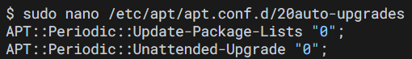

code:  
$ sudo nano /etc/apt/apt.conf.d/20auto-upgrades  
Function: Open Ubuntu’s automatic update configuration file to modify its settings.  

APT::Periodic::Update-Package-Lists "0";  
Purpose: Disable automatic updates of the package lists.  
"1" means enabled, "0" means disabled.  

APT::Periodic::Unattended-Upgrade "0";  
Purpose: Disable automatic installation of updates.  
"1" means semi-automatic updates enabled, "0" means completely disabled.  

(1): nano : Open the text editor.  
(2): APT : Ubuntu’s package management system.  
(3): Periodic : Periodic / automatically scheduled.  
(4): Update-Package-Lists : Update the package lists.  
(5): Unattended-Upgrade : Unattended upgrades (automatic updates without user interaction).  
(6): /etc/apt/apt.conf.d/20auto-upgrades : Ubuntu automatic update configuration file.  

2. Disable the fwupd-refresh timer   
--> Prevent fwupdmgr from automatically checking for any updates.   

code:  
$ sudo systemctl mask fwupd-refresh.timer  
Function: Disable automatic firmware updates.  

(1): systemctl : Control systemd services.  
(2): mask : Completely block a service (strongest way to disable it).  
(3): fwupd-refresh.timer : Periodically check for firmware updates.  

---
## 6. Install NVIDIA Optimized Ubuntu Kernel

### 1. Install the NVIDIA optimized Ubuntu kernel

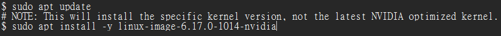

code:  
$ sudo apt update  
Function: Check which software packages are currently available for installation.  
$ sudo apt install -y linux-image-6.17.0-1014-nvidia  
Function: Install the specified NVIDIA version of the Linux kernel.  

(1): update : Refresh the package list so the system knows which versions are available in the repositories.  
(2): linux-image-6.17.0-1014-nvidia :
The name of the Linux kernel package to be installed.  

### 2. Update grub to change the default boot kernel  

#The version to use here depends on the latest version that was installed with the previous command.  

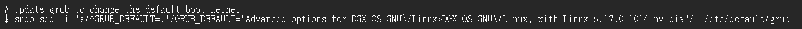

code:
$ sudo sed -i 's/^GRUB_DEFAULT=.*/GRUB_DEFAULT="Advanced options for DGX OS GNU/Linux>DGX OS GNU/Linux, with Linux 6.17.0-1014-nvidia"/' /etc/default/grub  
Function: Change the default Linux boot kernel to NVIDIA’s specified version, 6.17.0-1014-nvidia, ensuring the system always boots into Linux 6.17.0-1014-nvidia by default.  

(1): sed : Linux text replacement tool.  
(2): -i : Modify the file directly (in-place).  
(3): 's/old_text/new_text/' : Search-and-replace syntax.  
(4): ^GRUB_DEFAULT=.* : Match all lines starting with GRUB_DEFAULT=.  
" ^ " indicates the beginning of the line.  
" GRUB_DEFAULT= " specifies the setting name.  
" .* " represents any following content.  
(5): GRUB_DEFAULT="Advanced options for DGX OS GNU/Linux>DGX OS GNU/Linux, with Linux 6.17.0-1014-nvidia"   
: Set Linux 6.17.0-1014-nvidia as the default boot option.  
In sed, " / " is a special character, so " \/ " is used to represent an actual " / ".  
(6): /etc/default/grub : GRUB configuration file, GRUB is Linux bootloader.  

Overall process :  

Modify the GRUB configuration  
↓  
Set the default kernel  
↓  
System boots into the NVIDIA kernel by default on the next startup  

---
## 7. Configure Linux Kernel Command-line  
Purpose: Ensure the iommu.passthrough=y kernel parameter is NOT passed to the kernel  
--> Edit the parameter in the grub file and append or update the parameters described below  

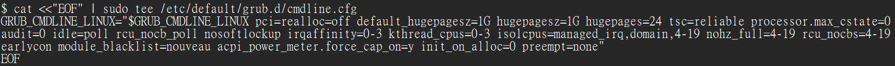

#NOTE: The hugepage size 1G is optimized for DGX Spark  

code:  
$ cat <<"EOF" | sudo tee /etc/default/grub.d/cmdline.cfg  
Function: Write the following kernel parameters into cmdline.cfg.  

(1): cat : Display text.  
(2): <<"EOF" : Treat all following text as input until EOF is encountered.  
(3): sudo tee : Write to a file with root privileges.  
(4): /etc/default/grub.d/cmdline.cfg : Create a new GRUB kernel parameter configuration file.  

code:  
GRUB_CMDLINE_LINUX="$GRUB_CMDLINE_LINUX pci=realloc=off default_hugepagesz=1G hugepagesz=1G hugepages=24 tsc=reliable processor.max_cstate=0 audit=0 idle=poll rcu_nocb_poll nosoftlockup irqaffinity=0-3 kthread_cpus=0-3 isolcpus=managed_irq,domain,4-19 nohz_full=4-19 rcu_nocbs=4-19 earlycon module_blacklist=nouveau acpi_power_meter.force_cap_on=y init_on_alloc=0 preempt=none"  
Function: Configure Linux for low-latency + realtime + DPDK + GPU-optimized mode  

(1): GRUB_CMDLINE_LINUX= : Set the Linux kernel boot parameters to this configuration.  
(2): pci=realloc=off : Disable PCIe resource reallocation to avoid PCIe resource conflicts.  
(3):  
default_hugepagesz=1G  
hugepagesz=1G  
: Linux memory normally uses 4KB pages, but DPDK/GPU workloads do not work well with highly fragmented small pages. Therefore, 1GB pages are used to reduce TLB misses, memory overhead, and latency. Without HugePages, DPDK may not run properly.  
(4): hugepages=24 : Allocate 24 × 1GB HugePages.  
(5): tsc=reliable : Force the use of a reliable time counter. 5G/PTP relies heavily on precise timing.  
(6): processor.max_cstate=0 : Prevent the CPU from entering power-saving sleep states, because CPU sleep states increase latency.  
(7): audit=0 : Disable Linux audit to reduce kernel overhead.  
(8): idle=poll : Keep the CPU awake and continuously polling. This consumes more power but provides the lowest latency.  
(9): rcu_nocb_poll : Make Linux RCU background work operate in polling mode, reducing interrupts and latency jitter, and improving DPDK / Aerial / 5G realtime stability.  
(10): nosoftlockup : Disable soft lockup checks to avoid false warnings under high load.  
(11): irqaffinity=0-3 : Pin IRQ interrupts to CPU 0-3 , leaving the other CPU cores for DPDK, cuBB, and GPU workloads.  
(12): kthread_cpus=0-3 : Allow kernel threads to run only on CPU0-3.  
(13): isolcpus=managed_irq,domain,4-19 : Isolate CPU 4-19 so Linux avoids using them. These cores are reserved for DPDK, cuBB, and realtime threads.  
(14): nohz_full=4-19 : Disable scheduler ticks on CPU 4-19 to reduce jitter.  
(15): rcu_nocbs=4-19 : Prevent RCU callbacks from running on CPU 4-19 to avoid interfering with realtime workloads.  
(16): earlycon : Enable Linux kernel debug messages during the very early boot stage, which helps debug kernel, driver, GPU, DPDK, or hardware initialization issues.  
(17): module_blacklist=nouveau : Disable the nouveau driver. Aerial must use the official NVIDIA driver.  
(18): acpi_power_meter.force_cap_on=y : Force-enable ACPI power meter power capping / monitoring features, making power and power-consumption management more stable on DGX/Aerial servers.  
(19): init_on_alloc=0 : Disable automatic memory zeroing during Linux memory allocation to reduce latency and CPU overhead, improving DPDK / Aerial / GPU server performance.  
(20): preempt=none : Disable kernel preemption to reduce context switching.  

code:  
EOF  
Function: End of the here document.  

---
## 8. Apply the Changes and Reboot to Load the Kernel  

### 1. Regenerate the boot configuration to apply the new kernel parameters  

code:  
$ sudo update-grub  
Function: Regenerate the GRUB boot configuration.  
$ sudo reboot  
Function: Reboot the system.  

### 2. Verify that the kernel command-line parameters are configured properly

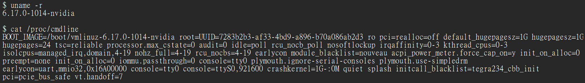

$ uname -r  
Function: Check the currently running Linux kernel version.  
Output:  
6.17.0-1014-nvidia  

(1): uname : Display the Unix/Linux system name.  
(2): -r : Show the Linux kernel version.  

$ cat /proc/cmdline  
Function: Display the actual boot parameters received by the Linux kernel.  
Output:  
BOOT_IMAGE=/boot/vmlinuz-6.17.0-1014-nvidia root=UUID=7283b2b3-af33-4bd9-a896-b70a086ab2d3 ro pci=realloc=off default_hugepagesz=1G hugepagesz=1G hugepages=24 tsc=reliable processor.max_cstate=0 audit=0 idle=poll rcu_nocb_poll nosoftlockup irqaffinity=0-3 kthread_cpus=0-3 isolcpus=managed_irq,domain,4-19 nohz_full=4-19 rcu_nocbs=4-19 earlycon module_blacklist=nouveau acpi_power_meter.force_cap_on=y init_on_alloc=0 preempt=none init_on_alloc=0 iommu.passthrough=0 console=tty0 plymouth.ignore-serial-consoles plymouth.use-simpledrm earlycon=uart,mmio32,0x16A00000 console=tty0 console=ttyS0,921600 crashkernel=1G-:0M quiet splash initcall_blacklist=tegra234_cbb_init pci=pcie_bus_safe vt.handoff=7  

(1): /proc/cmdline : Linux kernel boot parameter file. /proc is a virtual filesystem.  
(2): BOOT_IMAGE=/boot/vmlinuz-6.17.0-1014-nvidia : The currently booted kernel image is 6.17.0-1014-nvidia.  
(3): root=UUID=7283b2b3-af33-4bd9-a896-b70a086ab2d3 : Specifies where the Linux root filesystem is located.  
(4): ro : Initially mount the root filesystem as read-only, then switch back to read-write (rw) after boot.  
(5):
pci=realloc=off default_hugepagesz=1G hugepagesz=1G hugepages=24 tsc=reliable processor.max_cstate=0 audit=0 idle=poll rcu_nocb_poll nosoftlockup irqaffinity=0-3 kthread_cpus=0-3 isolcpus=managed_irq,domain,4-19 nohz_full=4-19 rcu_nocbs=4-19 earlycon module_blacklist=nouveau acpi_power_meter.force_cap_on=y init_on_alloc=0 preempt=none init_on_alloc=0  
: Confirm whether these parameters match the settings configured in the previous step.  
(6): iommu.passthrough=0 : Disable passthrough mode.  
(7): console=tty0 : Display the Linux console on the main screen.  
(8): plymouth.ignore-serial-consoles : Do not run Plymouth on the serial console, avoiding animation interference with serial logs.  
(9): plymouth.use-simpledrm : Use the simple DRM framebuffer to display the boot screen.  
(10): earlycon=uart,mmio32,0x16A00000 : Allow the kernel to output debug messages during the very early boot stage.  
uart : Use UART serial console.  
mmio32 : 32-bit memory-mapped I/O.  
0x16A00000 : UART controller address.  
(11): console=ttyS0,921600 : Specify the serial console, allowing remote server debugging.  
ttyS0 : The first serial port.  
921600 : Baud rate (transmission speed).  
(12): crashkernel=1G-:0M : Reserve memory for kdump / crash dumps.  
(13): quiet : Reduce the amount of boot log output displayed.  
(14): splash : Display the Ubuntu boot animation.  
(15): initcall_blacklist=tegra234_cbb_init :  
initcall_blacklist : Prevent a specific kernel initialization function from executing.  
tegra234_cbb_init : An initialization function for the NVIDIA Tegra234 platform.  
(16): pci=pcie_bus_safe : PCIe safe mode. Use more conservative PCIe bus settings to avoid resource allocation issues.  
(17): vt.handoff=7 : Control the transition from the boot console to the graphical console, making the boot screen transition smoother.  

### 3. Check if hugepages are enabled  

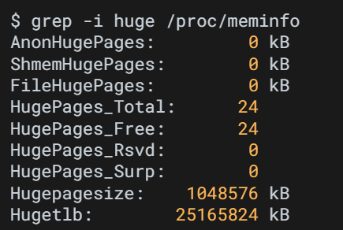

code:  
$ grep -i huge /proc/meminfo  
Function: Extract all HugePage-related information from Linux memory information.  
Output:  
AnonHugePages:         0 kB  
ShmemHugePages:        0 kB  
FileHugePages:         0 kB  
HugePages_Total:      24  
HugePages_Free:       24  
HugePages_Rsvd:        0  
HugePages_Surp:        0  
Hugepagesize:    1048576 kB  
Hugetlb:        25165824 kB  
#NOTE : Mainly focus on HugePages_Total, HugePages_Free, Hugepagesize, and Hugetlb. The other fields are not used.  

(1): huge : Search for entries containing huge.  
(2): /proc/meminfo : Linux real-time memory information.  

---
## 9. Install Dependency Packages  

Purpose: Install the prerequisite packages.  

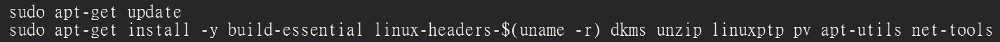

$ sudo apt-get update  
$ sudo apt-get install -y build-essential linux-headers-$(uname -r) dkms unzip linuxptp pv apt-utils net-tools  

code:  
$ sudo apt-get update  
Function: Update Ubuntu’s package list.  
$ sudo apt-get install -y build-essential linux-headers-$(uname -r) dkms unzip linuxptp pv apt-utils net-tools  
Function: Install the core development tools, kernel headers, PTP tools, and networking utilities required for the Aerial / DPDK / NVIDIA environment.  

(1): apt-get : Ubuntu package management tool.  
(2): update : Refresh the list of available software packages. This only updates the package index.  
(3): apt-get install : Install packages.  
(4): build-essential : Install the basic Linux build tools, including: gcc / g++ / make / libc-dev  
(5): linux-headers-$(uname -r) : Install the kernel headers corresponding to the currently running kernel.  
$(uname -r) : Command substitution. Execute the command inside the parentheses first, then insert the result into the original position. This ensures the headers exactly match the current kernel.  
(6): dkms : Automatically rebuild kernel modules when the kernel is updated.  
(7): unzip : Extract ZIP files.  
(8): linuxptp : Install Linux PTP tools for precise time synchronization.  
(9): pv : Display data transfer progress.  
(10): apt-utils : APT utility tools, used to avoid messages such as debconf: delaying package configuration.  
(11): net-tools : Traditional networking tools, including ifconfig, netstat, and route.  

---
## 10. Install DOCA OFED and Mellanox Firmware Tools on the Host  
#NOTE: Following the DOCA Installation Guide for Linux  
Link: https://docs.nvidia.com/doca/sdk/doca-installation-guide-for-linux/index.html

### 1. Check if there is an existing MOFED installed on the host system.  

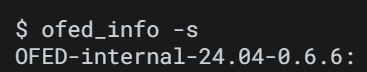

code:  
$ ofed_info -s  
Function: Display the currently installed Mellanox OFED version.  
Output:  
OFED-internal-24.04-0.6.6:  
Description: The currently installed Mellanox OFED version is 24.04.  

(1): ofed_info : View information about the Mellanox high-speed networking driver environment.  
(2): -s : Display short version information.  

### 2. Uninstall Existing MOFED Installation

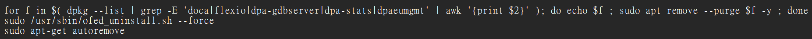

code:
$ for f in $( dpkg --list | grep -E 'doca|flexio|dpa-gdbserver|dpa-stats|dpaeumgmt' | awk '{print $2}' ); do echo $f ; sudo apt remove --purge $f -y ; done  
Function: Find all installed packages related to doca, flexio, and dpa-*, then completely remove them one by one.  
$ sudo /usr/sbin/ofed_uninstall.sh --force  
Function: Forcefully run the OFED uninstaller.  
$ sudo apt-get autoremove  
Function: Remove dependency packages that are no longer required by any installed package.  

#NOTE: Using game deletion as an analogy: the first line deletes the apps, the second line fully uninstalls the NVIDIA network driver stack, and the third line cleans up temporary files / unused DLLs / empty folders.  

(1): for f in : Perform an action for each package.  
(2): dpkg --list : List all Debian packages.  
(3): grep -E 'doca|flexio|dpa-gdbserver|dpa-stats|dpaeumgmt' : Filter package names.  
-E : Enable extended regular expressions.  
| : Allow OR conditions.  
(4): awk '{print $2}' : Extract the second column from each line. Column 1 = status, column 2 = package name. Only the package name is needed afterward.  
awk : Split each line of text into fields using spaces / tabs.  
(5): do ... done : Execute commands for each package.  
(6): echo $f : Display the package currently being processed, making it easier to know which package is being removed.  
(7): sudo apt remove --purge $f -y : Actually remove the package.  
apt remove : Remove the package.  
--purge : Remove the package together with its configuration files.  
$f : The current package name.  
(8): /usr/sbin/ofed_uninstall.sh : Shell script (uninstall script).  
/usr/ : Linux system program directory.  
/sbin/ : System binary directory.  
ofed_uninstall.sh : Official OFED uninstall script used to remove the RDMA stack, Mellanox driver, mlx5 module, OFED packages, and userspace libraries.  
(9): --force : Force mode.  
(10): autoremove : Automatically remove leftover unused packages.  

### 3.  Install DOCA OFED

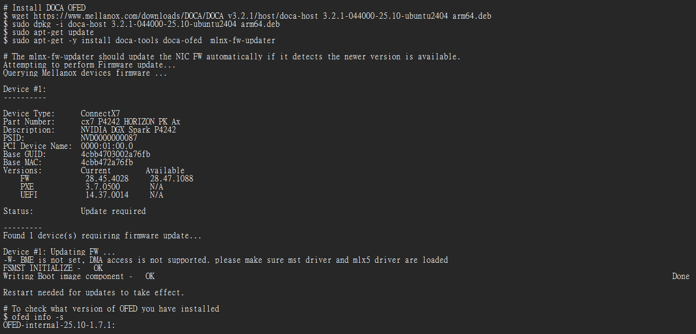

code:  
$ wget https://www.mellanox.com/downloads/DOCA/DOCA_v3.2.1/host/doca-host_3.2.1-044000-25.10-ubuntu2404_arm64.deb   
Function : Download the DOCA repository installation package (.deb file) from the NVIDIA/Mellanox official website.  
$ sudo dpkg -i doca-host_3.2.1-044000-25.10-ubuntu2404_arm64.deb  
Function : Install the NVIDIA DOCA repository package.  
$ sudo apt-get update  
Function : Re-download the package list.  
$ sudo apt-get -y install doca-tools doca-ofed  mlnx-fw-updater  
Function : Start installing NVIDIA DOCA / OFED / ConnectX-7 firmware tools.  

(1): wget : Linux download utility used to download files from the internet and save them into the current terminal directory.  
(2): https://www.mellanox.com/downloads/DOCA/（URL）: NVIDIA/Mellanox official download location.  
(3): doca-host_…deb : NVIDIA DOCA repository installation package for Ubuntu 24.04 ARM64 hosts. After installation, Ubuntu knows where to download doca-ofed and doca-tools.  
.deb : Debian Package (.deb).  
(4): dpkg : Debian package manager, the lowest-level package installation tool in Ubuntu/Debian.  
(5): apt-get update : Retrieve the package index from the NVIDIA server.  
(6): doca-tools : DOCA tool suite, including debug tools, diagnostic tools, and utilities.  
(7): doca-ofed : NVIDIA/Mellanox OFED networking stack. After installation, it provides RDMA, mlx5 drivers, ibverbs, RoCE, GPUDirect, and DPDK support.  
(8): mlnx-fw-updater : Mellanox firmware updater used to update ConnectX NIC firmware.  

Output:  
The mlnx-fw-updater should update the NIC FW automatically if it detects the newer version is available.  
(1):  
Attempting to perform Firmware update…  
Mean: Start updating the firmware.  
(2):  
Querying Mellanox devices firmware …  
Mean: Scan Mellanox/NVIDIA NICs and check their model, version, and firmware.  
(3):  
From Device #1: to Restart needed for updates to take effect.  
Point 1:  
FW             28.45.4028     28.47.1088  
Mean: The current NIC firmware version is 28.45.4028, but the NVIDIA repository provides a newer version 28.47.1088.  
Point 2:  
Status:           Update required  
Mean: Indicates that a firmware update is required.  
Point 3:  
Found 1 device(s) requiring firmware update…  
Mean: Found 1 NIC that requires a firmware update.  
Point 4:  
Device #1: Updating FW …  
Mean: Start updating the firmware.  
Point 5:  
-W- BME is not set, DMA access is not supported. please make sure mst driver and mlx5 driver are loaded  
Mean: Warning message.  
BME is not set: The NIC is not yet allowed to perform DMA directly.  
DMA access is not supported: DMA access is temporarily unavailable.  
please make sure mst driver and mlx5 driver are loaded: The mst driver is not fully loaded yet, and mlx5 is not ready.  
Point 6:  
FSMST_INITIALIZE -   OK  
Writing Boot image component -   OK        DONE  
Mean: Firmware update completed successfully.  
Point 7:  
Restart needed for updates to take effect.  
Mean: A reboot is required for the firmware update to actually take effect.  

code:  
$ ofed_info -s  
Function: Display the current OFED version information.  

Output:  
OFED-internal-25.10-1.7.  
Mean: Successfully upgraded to the 25.10 generation.  

6/2:
預期執行到：Install DOCA OFED and Mellanox Firmware Tools on the Host 完成  
時間 ： 6/2 19:00 ~ 22:00  

### 4. Verify installation

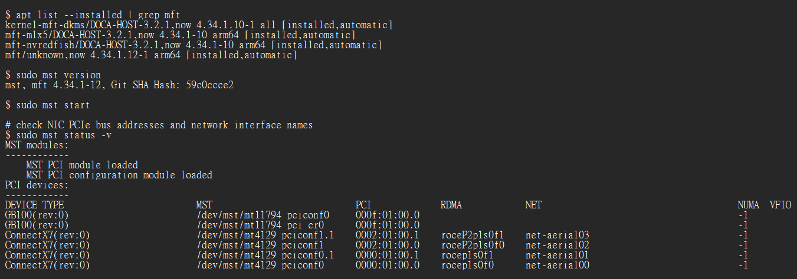

code:  
$ apt list --installed | grep mft  
Function: Check which MFT packages are currently installed on the system.  
(1): apt list --installed : List all installed packages.  
(2): grep mft : Display only packages whose names contain "mft".  

Output:  
kernel-mft-dkms/DOCA-HOST-3.2.1,now 4.34.1.10-1 all [installed,automatic]   
mft-mlx5/DOCA-HOST-3.2.1,now 4.34.1-10 arm64 [installed,automatic]  
mft-nvredfish/DOCA-HOST-3.2.1,now 4.34.1-10 arm64 [installed,automatic]
mft/unknown,now 4.34.1.12-1 arm64 [installed,automatic]

(1): kernel-mft-dkms : MFT kernel driver.  
dkms : Automatically rebuilds the driver when the Linux kernel is updated.  
(2): all : Not tied to any specific CPU architecture because this package mainly contains source code.  
(3): [installed,automatic] : Installed and automatically installed as a dependency.  
(4): mft-mlx5 : Management module specifically for ConnectX devices.  
(5): arm64 : Indicates that the package is intended for ARM CPUs.  
(6): redfish : A server remote management standard that allows management systems to use APIs to: Query hardware status/Update firmware/Manage devices. This is generally not used for Aerial deployments.  
(7): mft/unknown : APT does not know the original repository source of this package. This does not affect functionality; as long as it shows "installed", the package has been installed correctly.  
mft : Main package of Mellanox Firmware Tools.  

code:  
$ sudo mst version  
Function : Display the MST/MFT version information.  

Output:  
mst, mft 4.34.1-12, Git SHA Hash: 59c0ccce2  
Mean: MFT version = 4.34.1-12, Git Commit ID = 59c0ccce2.  

code:  
$ sudo mst start  
Function : Start the MST driver.  
Purpose: Allow Linux to directly manage and control ConnectX NICs.  

code:  
$ sudo mst status -v  
Function: Display all Mellanox/NVIDIA PCIe devices.  

Output:  
1. MST PCI module loaded  
Mean: The MST kernel driver has been loaded.  
2. MST PCI configuration module loaded  
Mean: The MST PCI configuration module has been loaded.  
3. PCI devices: ...  
Mean: Lists all devices detected by MST.  

### 5. Check the link status of port 0  

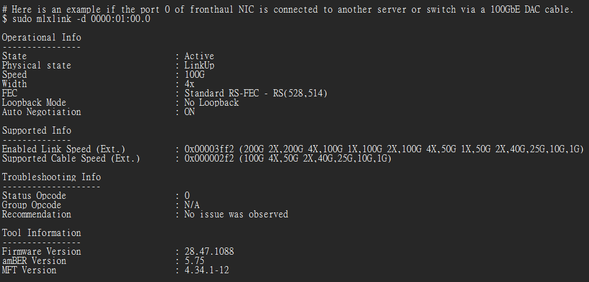

code:  
$ sudo mlxlink -d 0000:01:00.0   
Function: Check the physical link status of Port 1 on a ConnectX-7 adapter.  

(1): mlxlink : A link diagnostic tool provided by Mellanox.  
Purpose: Check whether the link is up, view link speed, view FEC settings, check DAC/fiber status, and inspect error statistics.  
(2): -d : Specify which NIC to inspect.  

Output:  
1. Operational Info...  
Mean: Current operational status.
2. Supported Info...  
Mean: The link speeds supported by this NIC.  
3. Troubleshooting Info...  
Mean: Used to quickly determine whether there is a problem with the ConnectX network card link and identify the possible cause.  
4. Tool Information...  
Mean: Displays the software and firmware version information related to the currently running mlxlink utility.  

(1):  
Width : 4x  
Mean: Data is being transmitted over 4 lanes.  
(2):  
Supported Cable Speed  
Mean: The link speeds supported by the currently connected DAC cable.  
(3):  
Status Opcode : 0  
Mean: No errors detected.  

### 6. Configure the CX7 NIC  

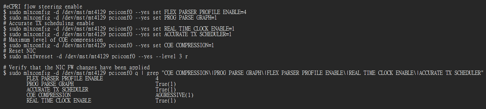

code:  
$ sudo mlxconfig -d /dev/mst/mt4129_pciconf0 --yes set FLEX_PARSER_PROFILE_ENABLE=4  
Function: Enable the eCPRI packet parser on ConnectX-7.  

(1): mlxconfig : Mellanox firmware configuration tool.  
(2): /dev/mst/mt4129_pciconf0 : Specify ConnectX-7 Port 0.  
(3): set : Modify a configuration parameter.  
(4): FLEX_PARSER_PROFILE_ENABLE : Select which packet parsing profile the NIC should use.  
(5): =4 : Profile 4, which corresponds to the eCPRI parser.  

$ sudo mlxconfig -d /dev/mst/mt4129_pciconf0 --yes set PROG_PARSE_GRAPH=1  
Function: Allow ConnectX-7 to use the Programmable Parser for parsing custom protocols.  

(1): PROG_PARSE_GRAPH : Enable the programmable packet parsing pipeline.  

$ sudo mlxconfig -d /dev/mst/mt4129_pciconf0 --yes set REAL_TIME_CLOCK_ENABLE=1  
Function: Enable the ConnectX-7 hardware real-time clock.  
$ sudo mlxconfig -d /dev/mst/mt4129_pciconf0 --yes set ACCURATE_TX_SCHEDULER=1  
Function: Enable hardware-level packet transmission scheduling.  
$ sudo mlxconfig -d /dev/mst/mt4129_pciconf0 --yes set CQE_COMPRESSION=1  
Function: Reduce the CPU overhead required to process the Completion Queue.  

(1): CQE_COMPRESSION : Completion Queue Entry compression.  
Compresses 100 CQEs into a smaller number of CQEs, reducing CPU interrupts and CPU load.  

$ sudo mlxfwreset -d /dev/mst/mt4129_pciconf0 --yes --level 3 r  
Function: Restart the ConnectX-7 adapter.  

(1): mlxfwreset : Mellanox Firmware Reset Tool.  
(2): --level 3 : Full reset.  
(3): r : Reset.  

$ sudo mlxconfig -d /dev/mst/mt4129_pciconf0 q | grep   "CQE_COMPRESSION|PROG_PARSE_GRAPH|FLEX_PARSER_PROFILE_ENABLE|REAL_TIME_CLOCK_ENABLE|ACCURATE_TX_SCHEDULER"  
Function: Query the current firmware settings.  

(1): q : Query. Its purpose is to display all configuration values.  
(2): grep : Filter and display only the specified firmware setting names."CQE_COMPRESSION\|PROG_PARSE_GRAPH\|FLEX_PARSER_PROFILE_ENABLE\|REAL_TIME_CLOCK_ENABLE\|ACCURATE_TX_SCHEDULER" :  
Display only the following firmware settings:  
FLEX_PARSER_PROFILE_ENABLE  
PROG_PARSE_GRAPH  
REAL_TIME_CLOCK_ENABLE  
ACCURATE_TX_SCHEDULER  
CQE_COMPRESSION  

Output:  
FLEX_PARSER_PROFILE_ENABLE                  4  
PROG_PARSE_GRAPH                            True(1)  
ACCURATE_TX_SCHEDULER                       True(1)  
CQE_COMPRESSION                             AGGRESSIVE(1)  
REAL_TIME_CLOCK_ENABLE                      True(1)  

Mean: According to the command output, the displayed configuration values show that the eCPRI Parser is enabled, the Programmable Parser is enabled, the NIC Hardware Clock is enabled, the Accurate TX Scheduler is enabled, and the maximum CQE compression mode is enabled.  

---
## 11. Install CUDA Driver  

### 1. Unload the current driver modules and uninstall the old driver  

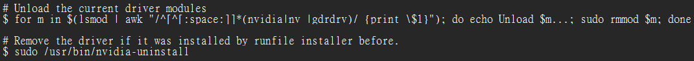

code:  
$ for m in $(lsmod | awk "/^[^[:space:]]*(nvidia|nv_|gdrdrv)/ {print \$1}"); do echo Unload $m...; sudo rmmod $m; done  
Funtion: Unload the current driver modules.  

$ sudo /usr/bin/nvidia-uninstall  
Function: Remove the driver if it was installed by runfile installer before.  

(1): lsmod : List all currently loaded kernel modules.  
(2): awk "/^[^[:space:]]*(nvidia|nv_|gdrdrv)/ {print $1}" : Display only modules whose names start with nvidia, nv_, or gdrdrv.  
(3): $(...) : Command substitution. Convert the query results into a list that can be used by the outer command.  
(4): echo : Display messages such as Unload nvidia... or Unload nvidia_uvm... to make it easier to monitor the progress.  
(5): rmmod : Remove Module. Unload a module from the Linux kernel.  

### 2. Install the NVIDIA open-source GPU kernel driver (OpenRM)

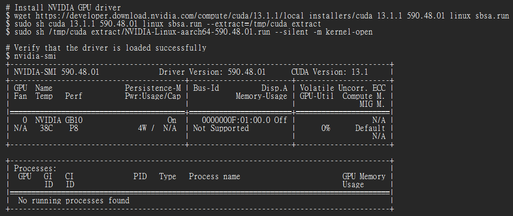

code:  
$ wget https://developer.download.nvidia.com/compute/cuda/13.1.1/local_installers/cuda_13.1.1_590.48.01_linux_sbsa.run  
Function: Download the CUDA 13.1.1 offline installer package from the NVIDIA website.  

(1): wget : File download utility.  

$ sudo sh cuda_13.1.1_590.48.01_linux_sbsa.run --extract=/tmp/cuda_extract  
Function: Extract the CUDA installation package.  

(1): sh : Execute a shell script.  
(2): --extract=/tmp/cuda_extract : Extract the package to /tmp/cuda_extract.  

$ sudo sh /tmp/cuda_extract/NVIDIA-Linux-aarch64-590.48.01.run --silent -m kernel-open  
Function: Install the NVIDIA GPU Driver 590.48.01.  

(1): aarch64 : ARM64   
(2): --silent : Perform a silent installation without displaying interactive menus.  
(3): -m kernel-open : Use the Open GPU Kernel Module.  

$ nvidia-smi  
Function: Verify that the driver is loaded successfully  

Output:

Mean:
Driver 590.48.01 installed successfully.  
CUDA 13.1 is functioning correctly.  
The Blackwell GPU (GB10) has been detected successfully.  
The GPU is currently in an idle state.  
The system is ready to run CUDA, Aerial, or AI workloads.  

(1): The first line shows that the driver version is correct.  
(2): Persistence-M is On : Persistence Mode is enabled.  
Purpose: Keep the NVIDIA driver loaded and resident in memory.  
(3): Perf is P8 : Indicates that the Performance State is currently in the idle/low-power state.  

---
## 12. Install Docker and Nvidia Container Toolkit  

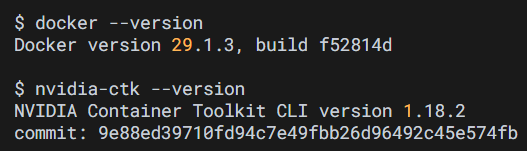

code:  
$ docker --version  
Function: Check the Docker version and verify that Docker is functioning properly.  

$ nvidia-ctk --version  
Function: Check the NVIDIA Container Toolkit version.  

NOTE:  
If the Nvidia container toolkit version is older than 1.17.4, run the following commands to upgrade to the current version:  

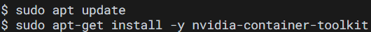

Mean: Update package information to the latest version and install the NVIDIA Container Toolkit.  

---
## 13. Install ptp4l and phc2sys  

### 1. Linuxptp 4.2 is used  

Purpose: Support dual port PTP  

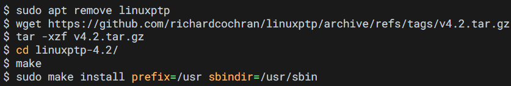

code:
$ sudo apt remove linuxptp  
Function: Remove the linuxptp package installed from the Ubuntu repository.  

$ wget https://github.com/richardcochran/linuxptp/archive/refs/tags/v4.2.tar.gz  
Function: Download the LinuxPTP 4.2 source code for time synchronization.  

$ tar -xzf v4.2.tar.gz  
Function: Extract v4.2.tar.gz.  

(1): tar : Linux archive utility.  
(2): -x : Extract files.  
(3): -z : Handle gzip-compressed archives.  
(4): -f : Specify the archive file.  

$ cd linuxptp-4.2/  
Function: Change to the LinuxPTP source code directory.  

$ make  
Function: Compile the source code, converting the C source files into executable programs.  

$ sudo make install prefix=/usr sbindir=/usr/sbin  
Function: Install the compiled programs into the Linux system.  

(1): make install : Execute the installation process.  
(2): prefix=/usr : Specify /usr as the installation directory for the program files.  
(3): sbindir=/usr/sbin : Specify /usr/sbin as the installation directory for system administration utilities.  

### 2. Configure PTP4L

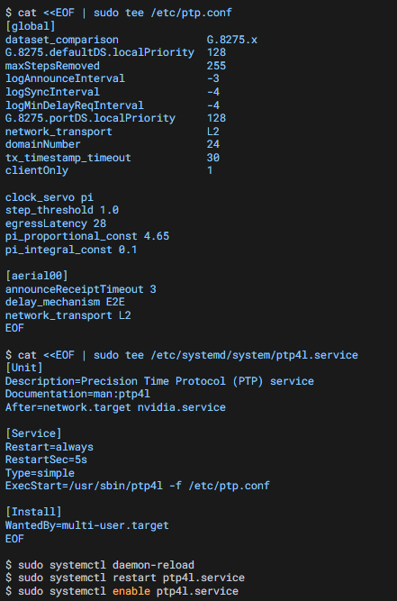

code:  
$ cat <<EOF | sudo tee /etc/ptp.conf  
...  
network_transport L2  
EOF  
Function: Create the /etc/ptp.conf configuration file.  

(1): cat <<EOF : Output all following text until EOF is encountered.  
(2): sudo tee /etc/ptp.conf : Write the output content into /etc/ptp.conf.  
Global Section  
(3): dataset_comparison G.8275.x : Specify the ITU-T G.8275.x telecom-grade PTP profile.  
(4): G.8275.defaultDS.localPriority 128 : PTP master election priority. A smaller value means higher priority. 128 is a neutral setting.  
(5): maxStepsRemoved 255 : Allow up to 255 PTP hops.  
(6): logAnnounceInterval -3 : Announce message interval. 2^(-3) = 1/8 second. The master sends an Announce message every 125 ms.  
(7): logSyncInterval -4 : Sync message interval. 2^(-4) = 1/16 second. A Sync message is sent every 62.5 ms.  
(8): logMinDelayReqInterval -4 : Delay Request interval. A Delay Request message is sent every 62.5 ms.  
(9): G.8275.portDS.localPriority 128 : Port election priority.  
(10): network_transport L2 : Use Ethernet Layer 2 transport for PTP messages.  
(11): domainNumber 24 : PTP domain number. Only devices in Domain 24 will synchronize with each other.  
(12): tx_timestamp_timeout 30 : Hardware timestamp timeout, up to 30 ms.  
(13): clientOnly 1 : Operate only as a PTP slave.  
(14): clock_servo pi : Use a PI controller for clock correction.  
(15): step_threshold 1.0 : If the clock error exceeds 1 second, step the clock immediately; otherwise, adjust it gradually.  
(16): egressLatency 28 : Compensate for packet transmission latency. Unit: nanoseconds (ns).  
(17): pi_proportional_const 4.65 : Proportional (P) gain. Provides immediate correction. 4.65 is the recommended intermediate value from NVIDIA.  
(18): pi_integral_const 0.1 : Integral (I) gain. Corrects long-term clock drift.  
aerial100 Section  
(19): announceReceiptTimeout 3 : If three consecutive Announce messages are missed, the master is considered unavailable.  
(20): delay_mechanism E2E : End-to-End delay measurement mechanism used by PTP.  
(21): network_transport L2 : Specify that PTP packets are transmitted over Layer 2 Ethernet.  

$ cat <<EOF | sudo tee /etc/systemd/system/ptp4l.service  
...  
WantedBy=multi-user.target  
EOF  
Function: Create a systemd service.

Unit Section  
(1): Description=Precision Time Protocol (PTP) service : Assign a name and description to this service.This is the time synchronization service.  
(2): Documentation=man:ptp4l : Specify where the service documentation can be found.   
(3): After=network.target nvidia.service : Start ptp4l only after the network and NVIDIA driver services have been started.  
Service Section
(4): Restart=always : Automatically restart ptp4l if it crashes or exits unexpectedly.  
(5): RestartSec=5s : Wait 5 seconds before restarting the service.  
(6): Type=simple : Tell systemd that this program runs continuously in the foreground after startup.  
(7): ExecStart=/usr/sbin/ptp4l -f /etc/ptp.conf : Specify the actual command to execute when the service starts.  
Install Section  
(8): WantedBy=multi-user.target : Define at which boot stage the service should be automatically started.  

$ sudo systemctl daemon-reload  
Function: Reload all systemd service configuration files.  
$ sudo systemctl restart ptp4l.service  
Function: Start (or restart) the ptp4l service immediately.  
$ sudo systemctl enable ptp4l.service  
Function: Enable the ptp4l service to start automatically at boot time.  

### 3.  Turn off NTP  

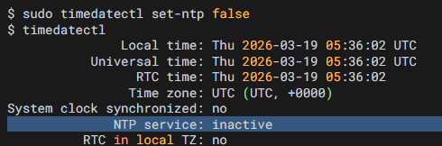

code:  
$ sudo timedatectl set-ntp false  
Function: Disable Linux NTP time synchronization.  

(1): timedatectl : Linux time management utility used to manage system time, time zones, RTC, and NTP.  
(2): set-ntp : Configure the NTP status.  

$ timedatectl  
Function: Display the current time synchronization status.  

Output:  
Mean: These three lines are the main indicators to verify the result.  

(1): System clock synchronized: no  
Mean: The system clock is not currently synchronized with any external time source.  
(2): NTP service: inactive  
Mean: The NTP service is disabled.  
(3): RTC in local TZ: no  
Mean: The RTC (Real-Time Clock) uses UTC. 
UTC = Coordinated Universal Time, the global standard time reference.  

### 4.  Run PHC2SYS as service

Function: PHC2SYS is used to synchronize the system clock to the PTP hardware clock (PHC) on the NIC.  

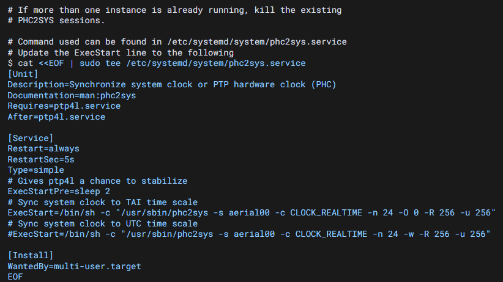

code:  
$ cat <<EOF | sudo tee /etc/systemd/system/phc2sys.service  
Function: Create the /etc/systemd/system/phc2sys.service file.  

[Unit]  
(1): Description=Synchronize system clock or PTP hardware clock (PHC) :  
Assign a name and description to the service.  
(2): Documentation=man:phc2sys :  
Specify the documentation location. The manual can be viewed with man phc2sys.  
(3): Requires=ptp4l.service :  
Indicates that phc2sys depends on ptp4l. If ptp4l is not running, phc2sys will not start.  
(4): After=ptp4l.service :  
Start ptp4l first, then start phc2sys.  

[Service]  
(5): Restart=always :  
Automatically restart phc2sys if it crashes or exits unexpectedly.  
(6): RestartSec=5s :  
Wait 5 seconds before restarting the service.  
(7): Type=simple :  
phc2sys runs continuously in the foreground.  
(8): ExecStartPre=sleep 2 :
Wait 2 seconds before starting phc2sys.  
This gives ptp4l time to stabilize before synchronization begins.  
(9): ExecStart=/bin/sh -c "/usr/sbin/phc2sys -s aerial00 -c CLOCK_REALTIME -n 24 -O 0 -R 256 -u 256" :  
Synchronize the ConnectX-7 Hardware Clock (PHC) to the Linux System Clock.  
-s aerial00 : source clock, using the PTP interface aerial00.  
-c CLOCK_REALTIME : target clock, the Linux system time (CLOCK_REALTIME).  
-n 24 : PTP Domain 24.  
-O 0 : Time offset compensation value. No additional compensation is applied.  
-R 256 : Update rate. The clock is adjusted 256 times per second, which is approximately once every 3.9 ms.  
-u 256 : Statistics reporting interval. Output synchronization statistics once every 256 updates.  

Note:  
PTP is based on TAI time and the system clock is synchronized to TAI time scale with the above PHC2SYS settings. The current offset between UTC and TAI is 37 seconds (leap seconds) and TAI is ahead of UTC by this amount. If there is a need to change the system clock to UTC time on DU, the first ExecStart with should be commented out and the second ExecStart with should be uncommented assuming the PTP and GrandMaster are properly configured.  

Difference: -O 0 → -w

-w : Wait mode.  
Automatically obtains and follows the UTC offset, leap second information, and TAI (International Atomic Time) data from ptp4l.  

[Install]  
(10): WantedBy=multi-user.target :  
Start the service automatically during system boot when the system reaches the multi-user operating mode.  

### 5. Reload the modified systemd service files and apply the new configuration.  

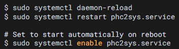

code:  
$ sudo systemctl daemon-reload  
Function: Instruct the system to reload the modified service files.  
$ sudo systemctl restart phc2sys.service  
Function: Start (or restart) phc2sys.service immediately.  

(1): restart :  
If the service is not running → start it.  
If the service is already running → stop it first, then start it again.  

$ sudo systemctl enable phc2sys.service  
Function: Configure phc2sys to start automatically at boot.  

(1): enable :  
Does not start the service immediately; it only creates the boot-time startup configuration.  

### 6. Verify that the system clock is synchronized  

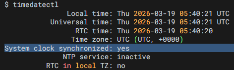

Output:  
(1):  
Local time: Thu 2026-03-19 05:40:21 UTC  
Universal time: Thu 2026-03-19 05:40:21 UTC  
Mean: Local time and Universal time are identical, indicating that the system is using UTC as its standard time zone.  
(2):  
System clock synchronized: yes  
NTP service: inactive  
Mean: NTP is disabled, and PTP has successfully taken over time synchronization. The Linux system clock is now synchronized through PTP.  

---
## 14. Setup the Boot Configuration Service

### 1. Create cpu-dma-latency service on DGX Spark

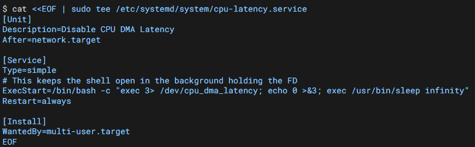

code:  
$ cat <<EOF | sudo tee /etc/systemd/system/cpu-latency.service  
...  
EOF  
Function: Create the /etc/systemd/system/cpu-latency.service file.  

[Unit]  
(1): Description=Disable CPU DMA Latency :  
Disable CPU DMA latency restrictions and keep the CPU in a low-latency operating state.  
(2): After=network.target :  
Start this service after the network has been initialized.  

[Service]  
(3): ExecStart=/bin/bash -c "exec 3> /dev/cpu_dma_latency; echo 0 >&3; exec /usr/bin/sleep infinity"  
exec 3> /dev/cpu_dma_latency : Inform the kernel of the maximum latency that can be tolerated.  
exec 3> : Create File Descriptor 3 and connect it to /dev/cpu_dma_latency.  
echo 0 >&3 : Write 0 to /dev/cpu_dma_latency.  
Maximum allowed latency = 0 microseconds, which prevents the CPU from entering deep sleep states.  
exec /usr/bin/sleep infinity : Keep the file descriptor open indefinitely so the latency requirement remains active.  
(4): Restart=always :  
If the service terminates unexpectedly, systemd automatically restarts it to ensure that low-latency CPU mode remains enabled.  

[Install]  
(5): WantedBy=multi-user.target :  
Start the service automatically at boot.  

### 2. Set the file permissions, reload the systemd daemon, enable the service, restart the service and check status  

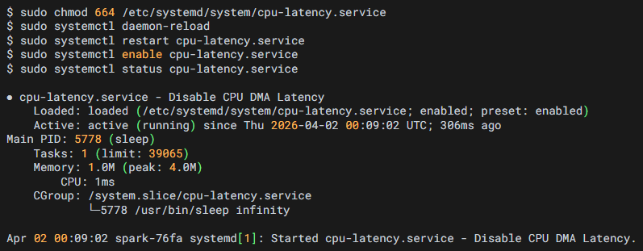

code:  
$ sudo chmod 664 /etc/systemd/system/cpu-latency.service  
Function: Change the file permissions of cpu-latency.service.  

(1): chmod : Change Mode (modify file permissions).  
(2): 664 :  
6 = rw- → Owner permissions: read and write.  
6 = rw- → Group permissions: read and write.  
4 = r-- → Others permissions: read-only.  

$ sudo systemctl daemon-reload  
Function: Notify systemd to reload the newly added service definition.  
$ sudo systemctl restart cpu-latency.service  
Function: Immediately execute the command specified in ExecStart=.  
$ sudo systemctl enable cpu-latency.service  
Function: Create a symbolic link in multi-user.target.wants.  
This ensures that cpu-latency.service starts automatically at every system boot.  
$ sudo systemctl status cpu-latency.service  
Function: Check the service status and verify that it is running successfully  

Output:  
Loaded: loaded  
Mean: systemd successfully loaded the service file.  
Active: active  
Mean: The service is currently running.  
Main PID: 5778 (sleep)  
Mean: The main process is sleep, which is expected and indicates normal operation.  
Started cpu-latency.service - Disable CPU DMA Latency.  
Mean: The service started successfully.  

### 3. Create the directory and create the file to run the commands with every reboot

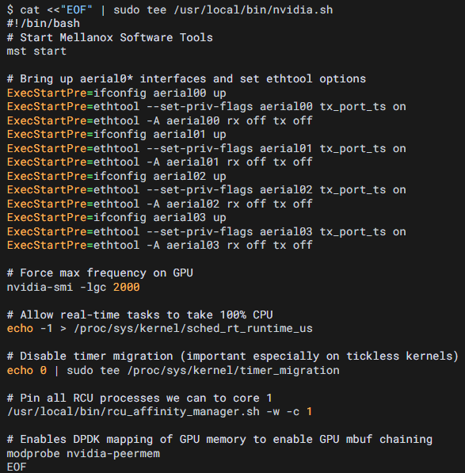

code:
$ cat <<"EOF" | sudo tee /usr/local/bin/nvidia.sh  
...  
EOF  
Function: Create /usr/local/bin/nvidia.sh.  

(1): #!/bin/bash : Tell Linux to execute this script using Bash.  
(2): mst start : Start MST (Mellanox Software Tools).  
(3):
ExecStartPre=ifconfig aerial0* up  
ExecStartPre=ethtool --set-priv-flags aerial0* tx_port_ts on  
ExecStartPre=ethtool -A aerial00 rx off tx off  
Function:  
Enable all aerial0* network interfaces.  
Enable TX Hardware Timestamping.  
Disable Ethernet Flow Control.  
(4): rx off : Disable RX Pause Frames.  
(5): tx off : Disable TX Pause Frames.  
(6): nvidia-smi -lgc 2000 : Lock the GPU clock and force the GPU to run at maximum frequency.  
(7): echo -1 > /proc/sys/kernel/sched_rt_runtime_us :  
Allow real-time processes to use 100% CPU. -1 means unlimited.  
(8): echo 0 | sudo tee /proc/sys/kernel/timer_migration :  
Disable timer migration.  
(9): /usr/local/bin/rcu_affinity_manager.sh -w -c 1 :  
Pin RCU threads to CPU Core 1. -c 1 means binding them to Core 1.  
(10): modprobe nvidia-peermem :  
Enable DPDK mapping of GPU memory to support GPU mbuf chaining.  

